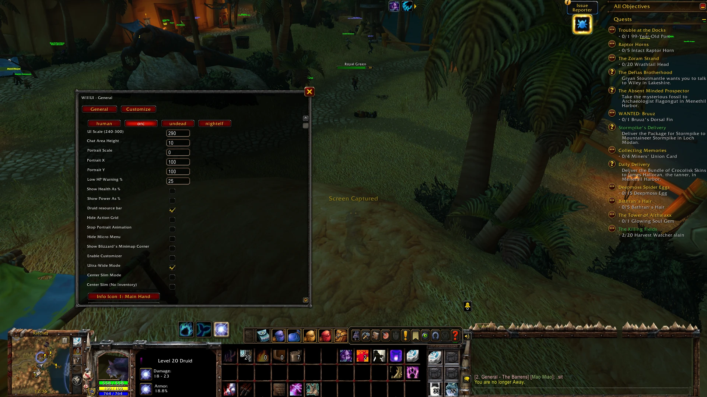
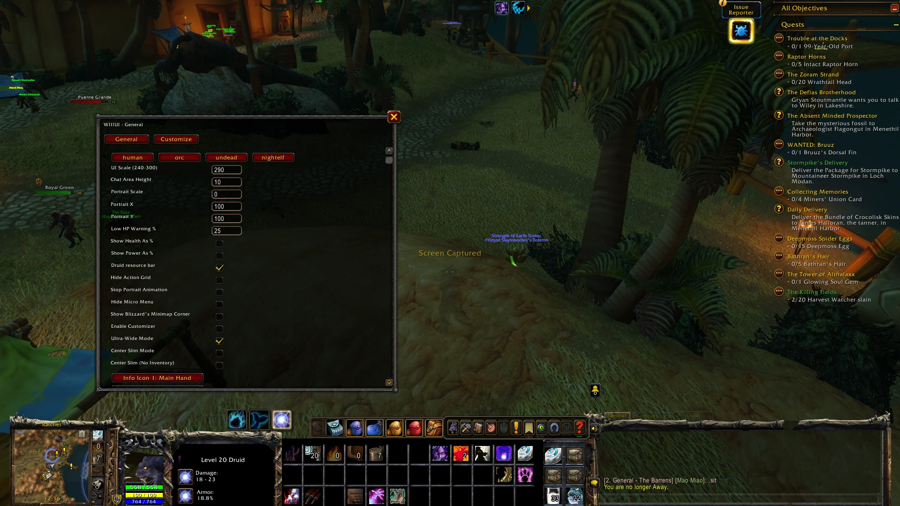
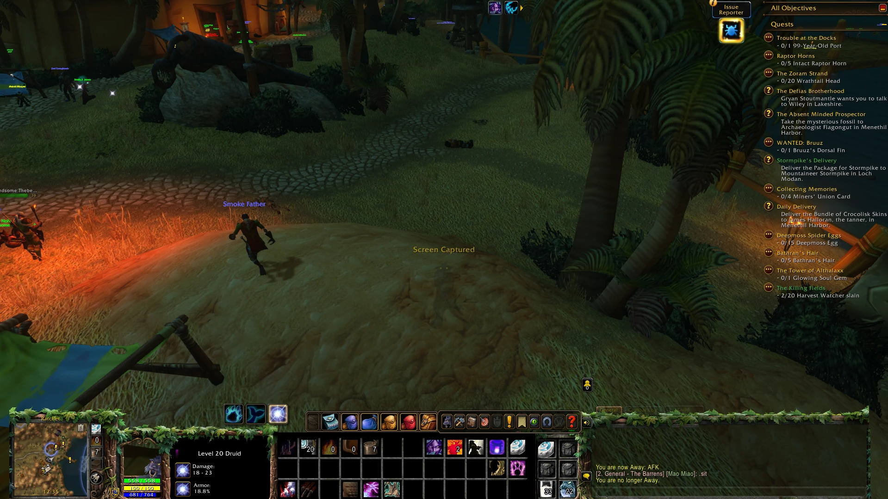

# WIIIUI (Warcraft III - UI) for World of Warcraft: Forever and retail

A full replacement for the bottom of your screen, styled after the Warcraft III in-game console: minimap and portrait on the left, your action bars in the middle, a chat panel on the right, plus an experience bar and health and power readouts.

## About this fork

This is a **separate build of WIIIUI made for World of Warcraft: Forever and retail**. It is not compatible with vanilla (1.12) clients. If you play vanilla, use the original addon instead.

**The concept and the art are the work of Fiur**, who created WIIIUI. Thank you, Fiur, for a wonderful addon. Original repository: https://github.com/Fiurs-Hearth/WIIIUI

The original has not been updated in over a year and was written for vanilla. This fork carries the same look over to the current game clients.

## Screenshots

*Taken on World of Warcraft: Forever at 1920×1080, UI Scale 290 with Ultra-Wide Mode on (the defaults), with WIIIUI's Edit Mode layout imported (see Getting started). Most show the config menu open.*

**Human**


**Orc**


**Undead**


**Night Elf**


## Features

* Four faction themes from Warcraft III: Human, Orc (the default), Undead and Night Elf.
* Replaces Blizzard's bottom action bars with its own, so you do not need Bartender or a similar addon.
* 3 extra action slots next to the minimap (your hearthstone is placed in the top one automatically) and 6 extra "inventory" slots for spells, items and consumables. You can bind keys to all nine in the game's Key Bindings screen, under the "Warcraft III - UI" heading.
* Health and power display, an experience bar, and a low-health warning.
* **Druid resource bar:** for druids, an extra bar keeps your mana visible while the middle bar shows your current form's resource (rage or energy). Switch it with the **Druid resource bar** checkbox (shown for druids only).
* **Minimap pieces** in the console art: a mail icon (lights up when you have mail; hover it to see the senders), a tracking button in the round slot (click it for the tracking menu), the zone name above the minimap, a clock (click it for the time manager) and a calendar button. Blizzard's own minimap corner at the top right is hidden; the **Show Blizzard's Minimap Corner** checkbox brings it back.
* **UI Scale** sets the overall size of the console, from 240 to 300 (290 by default). Above 270 the text grows along with the console.
* Icons that show information about your character, such as weapon damage and armor.
* Layout options (three checkboxes in the General tab, see below). Changing these no longer needs a reload.
* A Customize tab in the config menu to adjust the position, size, transparency and look of individual parts of the UI. It only takes effect while **Enable Customizer** (a checkbox on the General tab) is ticked.
* Your settings are saved per character.

Custom themes (your own art folders) are **not supported** in this fork. If you would like them, please open an issue.

## Installation

Requires **World of Warcraft: Forever** or **retail**. Vanilla 1.12 and unofficial clients are not supported.

1. [Download the addon](https://github.com/Johan-p/WIIIUI-Forever-Fork/archive/refs/heads/master.zip)
2. Unpack the zip. Inside is a folder named `WIIIUI-Forever-Fork-master`.
3. Rename that folder to `WIIIUI`. The folder name must be exactly `WIIIUI`, or the game ignores the addon.
4. Put the renamed folder into your AddOns folder, so that `...\Interface\AddOns\WIIIUI\WIIIUI.toc` exists:
   * **WoW Forever (beta):** `World of Warcraft\_classic_beta_\Interface\AddOns`
   * **Retail:** `World of Warcraft\_retail_\Interface\AddOns`
5. Start the game, or restart it if it was running. A new addon needs a full restart, not just `/reload`.
6. Make sure **WIIIUI** is ticked in the AddOns list on the character select screen.

**Alternative: install with git** (no renaming needed, and updating is just `git pull`). Open a terminal in your AddOns folder and run:

```
git clone https://github.com/Johan-p/WIIIUI-Forever-Fork.git WIIIUI
```

The trailing `WIIIUI` sets the folder name. To update later, run `git pull` inside the `WIIIUI` folder and restart the game.

## Getting started

* **Open the config menu:** move your mouse into the bottom-right corner of the screen. A cogwheel appears; click it. There are no slash commands. The menu has a General tab and a Customize tab, and a Reload UI button.
* **Some options live in Edit Mode.** On current game clients, Blizzard controls where things like the buff icons, the cast bar, the bags and the shapeshift bar sit. In the config menu those options show a "set in Edit Mode" note instead of a control. Move those pieces with the game's own Edit Mode.
* **Layout modes.** Three checkboxes in the General tab:
  * **Ultra-Wide Mode** shifts the chat panel's edges to suit very wide screens. It is on by default.
  * **Center Slim Mode** hides the chat area but keeps the inventory panel.
  * **Center Slim (No Inventory)** hides the whole right-hand panel, chat area and inventory both.
  If both Center Slim boxes are ticked, Center Slim Mode wins.
* **The extra slots share action bar page 2.** The 9 extra slots (3 by the minimap, 6 in the inventory) are action slots 13 to 21, which is page 2 of the main bar. If you page your main bar to page 2 (for example with Shift+2), you see the same actions, and changing them there changes the minimap and inventory slots too. This is intended.
* **Import WIIIUI's Edit Mode layout.** WIIIUI ships a ready-made Edit Mode layout for the pieces Blizzard controls (chat, bags, micro menu, cast bar, buffs, stance and pet bars). To use it: open WIIIUI's config (the cogwheel in the bottom-right corner), click the "Copy layout string" box, press Ctrl+A then Ctrl+C, and close the config. Then open the Game Menu (Esc), choose Edit Mode, open the layout dropdown at the top, choose Import, paste the string and a name for the layout into the two boxes, and click the import button. If Import is greyed out, you already have the maximum number of layouts; delete one first. It was made at UI Scale 290 with Ultra-Wide Mode on, at 1920x1080, so on other setups some pieces may need a nudge in Edit Mode. Config rows that say "set in Edit Mode" refer to this layout.
* **Saved settings may not stick on some Forever beta builds.** WIIIUI works with default settings on every login, so if your choices are forgotten, that is why. Settings also cannot be saved if the game's saved-settings files are read-only, so check that too.

## Support and feedback

Found a problem or want a feature? Please open an issue: https://github.com/Johan-p/WIIIUI-Forever-Fork/issues
